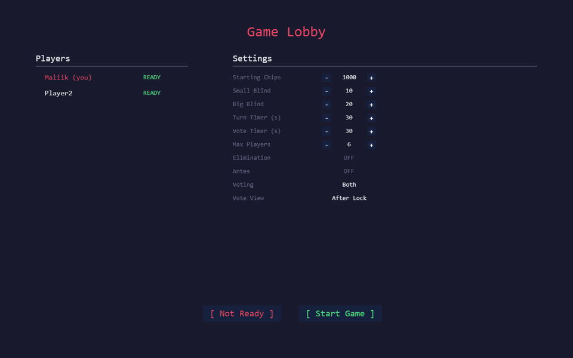
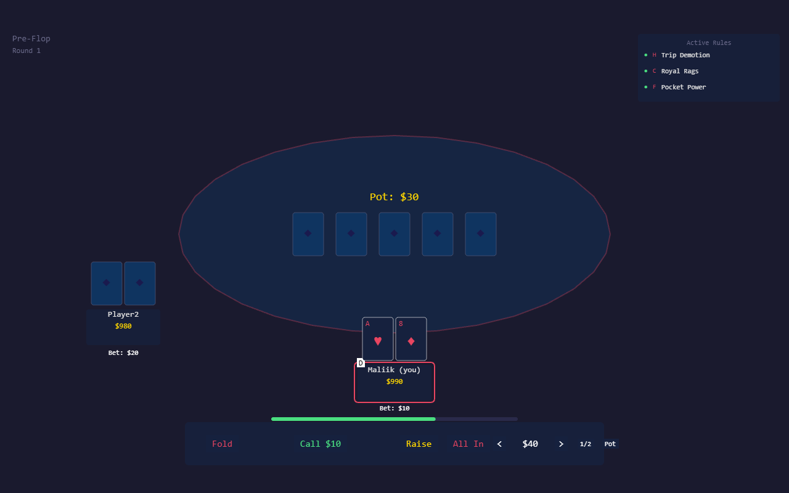
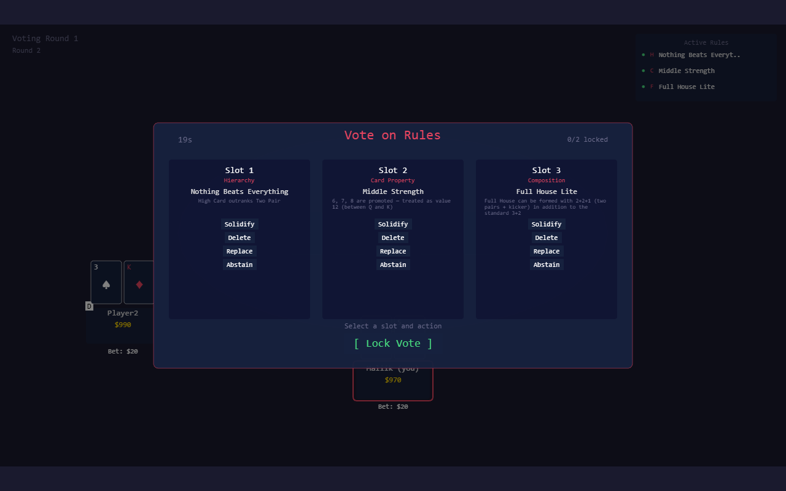

# RogueEr -- Multiplayer Poker Roguelike

A multiplayer poker game where the rules mutate every round. Players vote on rule changes that alter hand rankings, card properties, and win conditions, creating a different game at every table.


---



*Lobby → Pre-Flop round 1 → Voting on rule mutations → Pre-Flop round 2 with the new ruleset active.*

---

## How It Works

Standard Texas Hold'em, but between betting rounds players vote on **rule mutations** drawn from a pool of 30 rules across three categories:

- **Hierarchy** -- Reorder hand rankings (e.g., flushes beat full houses, pairs become the strongest hand)
- **Card Property** -- Transform cards mid-game (wild cards, suit removal, ace splitting into two values)
- **Composition** -- Change what counts as a hand (three-card flushes, full house lite, hole-card-only straights)

Each round has 3 active rule slots. Players vote to **solidify**, **delete**, or **replace** rules, creating an evolving meta-game on top of the poker.

### Screens

| | |
|---|---|
|  |  |
| Pre-flop betting with hole cards visible (yours only), pot tracking, active rule slots, and turn timer | Voting UI with the three active rules and Solidify / Delete / Replace / Abstain actions per slot |

## Architecture

```
packages/
  shared/    # Deterministic game logic (hand evaluation, rule engine,
               betting, pot calculation, deck management)
  server/    # Colyseus game server (room state machine, phase engine,
               voting resolution, turn timers, lobby management)
  client/    # Phaser 4 game client (table rendering, betting controls,
               voting UI, rule display, network manager)
```

All game logic lives in `shared/` as pure functions, used by both server and client. The server is authoritative -- it orchestrates phases, validates actions, and syncs state via Colyseus schemas with per-client visibility (your hole cards are hidden from other players).

### Round flow (14-phase state machine)

```
LOBBY ─→ ROUND_START ─→ DEAL
                          │
                          ▼
                    PRE_FLOP_BET ──(all but one folded?)──┐
                          │                               │
                          ▼                               │
                       VOTING_1                           │
                          │                               │
                          ▼                               │
                        FLOP ─→ FLOP_BET ─────────────────┤
                          │                               │
                          ▼                               │
                       VOTING_2                           │
                          │                               │
                          ▼                               │
                        TURN ─→ TURN_BET ─────────────────┤
                          │                               │
                          ▼                               │
                       RIVER ─→ RIVER_BET ────────────────┤
                          │                               │
                          ▼                               │
                      SHOWDOWN ─────────────────────────→ ROUND_END
                                                          │
                                                          ▼
                                                     (next ROUND_START)
```

Interactive phases (`*_BET`, `VOTING_*`, `LOBBY`) wait on player actions or timeouts. Non-interactive phases (`DEAL`, `FLOP`, `TURN`, `RIVER`, `ROUND_END`) auto-advance after a short pause for client animation. Full diagram with timer rules, betting state transitions, and voting modes lives in [`docs/01-game-state-machine.md`](docs/01-game-state-machine.md).

### Key Systems

- **4-Stage Evaluation Pipeline** -- hierarchy reorder, card transform, composition modify, then evaluate. Rules compose cleanly without special-casing. See [`docs/02-rule-engine.md`](docs/02-rule-engine.md).
- **14-Phase State Machine** -- Deal, betting rounds, voting rounds, showdown, and round end, with auto-advance for non-interactive phases.
- **Per-Client Schema Visibility** -- Hole cards ship as a direct server-to-client message, not in the synced state; only a sanitized `holeCardCount` is in the schema, used to render face-down cards for opponents. See [`docs/03-colyseus-schema.md`](docs/03-colyseus-schema.md).
- **Seeded RNG** -- Mulberry32 PRNG for reproducible shuffles and rule draws.
- **Side Pots** -- Multi-level side pot creation on all-in with proper odd-chip distribution.
- **Spectator Support** -- Join mid-game, queue for a seat, delayed hole card reveal.

## Status

Phases 1-4 complete. Core game loop is fully playable: lobby, full Hold'em rounds with rule mutations, voting, showdown, and multi-round progression. Phase 5 (Tauri packaging, audio, visual polish) is next.

`9.5K LOC` | `180 tests`

## Development

```bash
pnpm install
pnpm build          # Build all packages
pnpm --filter server dev   # Start Colyseus server (ws://localhost:2567)
pnpm --filter client dev   # Start Vite dev server
```

## License

All rights reserved. See [LICENSE](LICENSE).
